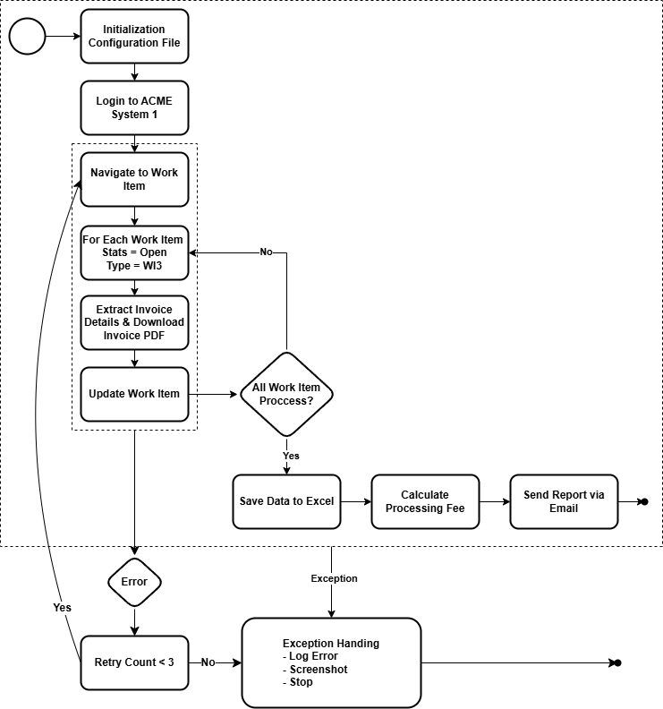

# ACME RPA Case Study – Invoice Automation with UiPath

This project showcases an end-to-end Robotic Process Automation (RPA) solution built using UiPath for the ACME Test System.

## 🛠 Features
- Logs into the ACME System 1 application using provided credentials
- Extracts all open WI3-type work items
- Retrieves and downloads corresponding PDF invoices
- Performs Excel-based data processing and calculations (e.g., processing fee, total amount)
- Updates the work item status in the system
- Sends a summary report with attachments via email

## 📂 Outputs
- Final Excel report
- Zipped PDF folder of invoices

## 🔧 Application Used
- UiPath
- Chrome
- Excel
- Email (SMTP)

## 📸 Screenshots

## 🎥 Demo Video
Here are two demo runs showcasing the UiPath RPA automation:

### 🔹 First Run – Full Automation Flow
▶️ [Click to watch](https://drive.google.com/file/d/124knB9pgtjf2HfIjY8cQ8u-BmldFlg_n/view?usp=sharing)  
Covers the complete workflow:
- Login to ACME System 1
- Work item extraction (WI3)
- Invoice data scraping & PDF downloads
- Excel processing & email report

---

### 🔹 Second Run – No Work Items Remaining
▶️ [Click to watch](https://drive.google.com/file/d/1i1ele23AVdpDA1mL333p20uD0uqNCiDu/view?usp=sharing)  
Demonstrates behavior when all WI3 work items have already been processed:
- System login
- No items found message handled gracefully
- Email summary sent notifying that there is no item to be process, but process exits cleanly with logs

### 🔹 Exception Handling (Wrong Login Credentials)  
▶️ [Click to watch](https://drive.google.com/file/d/1902-dymkN9ylPUXtakxWIP21lYlxEa2R/view?usp=sharing)  
Simulates invalid login attempt:
- Logs error to file  
- Captures a screenshot of the failure

## 📄 Documentation
You can download the **Design Document for ACME TEST Application RPA Automation** using the link below:

[Download the Design Document](assets/Design%20Document%20for%20ACME%20TEST%20Application%20RPA%20Automation.docx)
